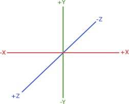

# Basics

## Build

See [compilation](Compilation.md) and [dependencies](Dependencies.md).

## Coordinate system

We are using the default opengl right handed coordinate system with x going right, y going upwards and z point towards you.

We are using column major matrices.



## Unittests

If you are going to contribute, make sure that you are adding unittests, too. I won't make promises about not breaking anything
if there aren't unittests that are telling me that I've broken something.

To add a unittest, each module (`src/modules/XXX`) has a `tests/` subdirectory. The `CMakeLists.txt` in the module directory adds the source files from that folder.

```cmake
set(TEST_SRCS
  [...]
)
gtest_suite_begin(tests-${LIB} TEMPLATE ${ROOT_DIR}/src/modules/core/tests/main.cpp.in)
gtest_suite_sources(tests-${LIB} ${TEST_SRCS})
gtest_suite_deps(tests-${LIB} ${LIB})
gtest_suite_end(tests-${LIB})
```

## Coding style

Rule of thumb - stick to the existing coding style - you can also use the `clang-format` settings to format your code. In general
you should not include any whitespace or formatting changes if they don't belong to your code changes.

If you do a formatting change, this should not be mixed with code changes - make a dedicated commit for the formatting.

Avoid using the STL were possible - see [Orthodox C++](https://gist.github.com/bkaradzic/2e39896bc7d8c34e042b).

## Commit messages

Commit messages should match the usual git commit message guidelines. Keep the summary short - put an UPPERCASE prefix in front
of it and try to explain why the change was made - not what you changed (because that is part of the commit diff already).

The prefix is usually the module name. E.g. if you are changing code in `src/modules/voxelformat` the prefix would be `VOXELFORMAT`. A commit message could look like this:

```
VOXELFORMAT: summary

detail message line 1
detail message line 2
```

## Modules

| Name             | Description                                                                |
| ---------------- | -------------------------------------------------------------------------- |
| app              | Basic application classes                                                  |
| command          | Bind c++ functionality to console commands                                 |
| commonlua        | Basic [lua](LUAScript.md) bindings and helper                              |
| color            | Color conversions and helpers                                              |
| core             | String, collections and other foundation classes                           |
| http             | Http download module                                                       |
| image            | Image loading and writing                                                  |
| io               | Stream and file handling                                                   |
| math             | Based on glm                                                               |
| memento          | The undo/redo states for a scene graph instance                            |
| metric           | telegraf, influx and other metrics                                         |
| noise            | Different noise implementations                                            |
| palette          | Palette formats and helper                                                 |
| render           | General renderer implementations and helpers                               |
| scenegraph       | Scene graph and scene graph node implementation                            |
| testcore         | Visual test helpers                                                        |
| ui               | DearImgui based ui code                                                    |
| util             |                                                                            |
| video            | [Window and renderer](ShaderTool.md) module                                |
| voxel            | The voxel engine code based on PolyVox                                     |
| voxelcollection  | Browse online and local voxel collections                                  |
| voxelfont        | TTF font to voxel                                                          |
| voxelformat      | Several volume and mesh based file formats to load or generate voxels      |
| voxelgenerator   | LUA generator, space colonization, tree- and shape generators              |
| voxelpathtracer  | Path tracer                                                                |
| voxelrender      | Voxel renderer                                                             |
| voxelutil        | Pathfinding, raycasting, image and general util functions                  |
