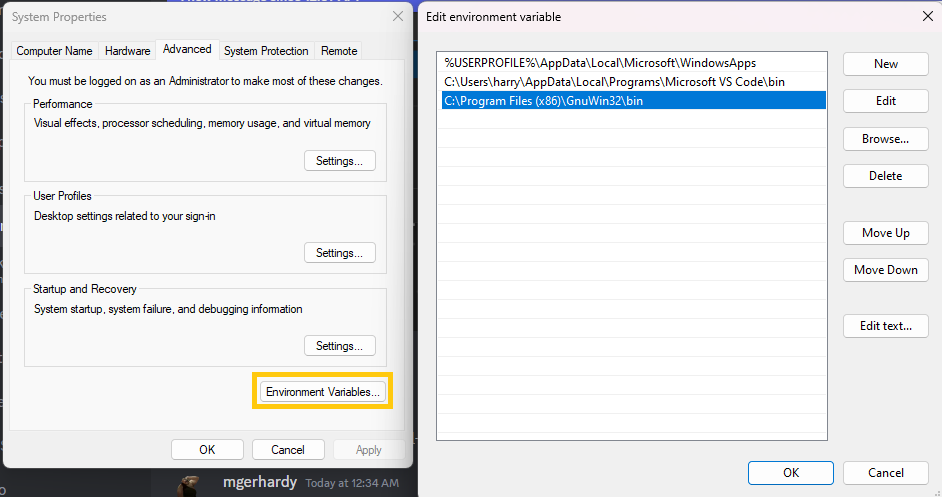
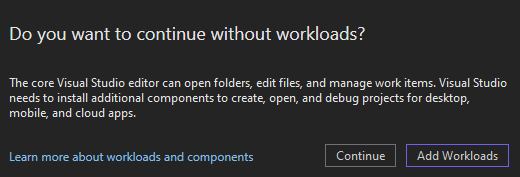
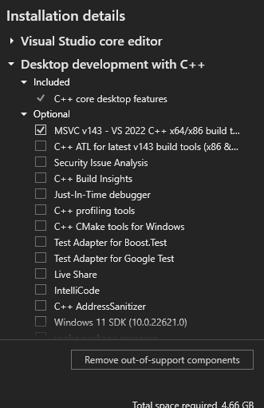
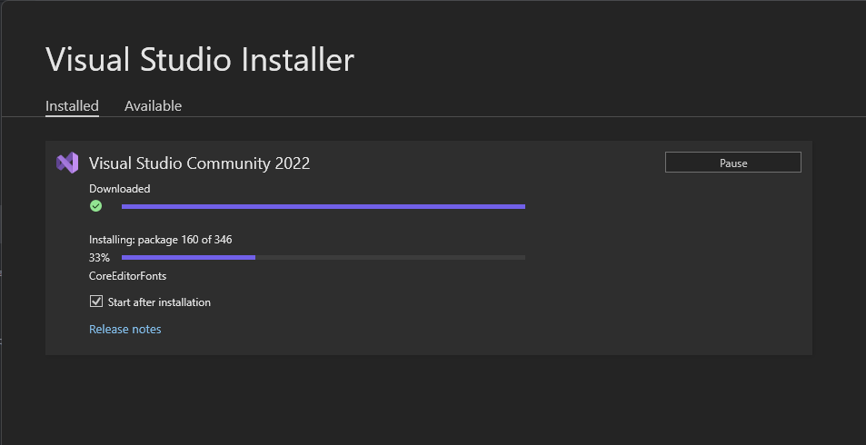

# Building

The project should work on Linux, Windows and OSX. It should work with any ide that is either supported by cmake or has direct cmake support. Personally I'm using vscode with clangd at the moment. But also the command line with plain old `make`.

## Linux

There is a `Makefile` wrapper around the build system. You can just run `make` in the project root folder.

Every project has some extra CMake targets. There are e.g. `voxedit-run`, `voxedit-debug` and `voxedit-perf` if the needed tools were found during cmake's configure phase.

That means that you can compile a single target by typing `make voxedit`, run it by typing `make voxedit-run`, debug it by typing `make voxedit-debug` and profile it by
typing `make voxedit-perf`. There are also other targets for valgrind - just use the tab completion in the build folder to get a list.

## Windows

The project can be built with every ide that supports cmake. QTCreator, Eclipse CDT, vscode or Visual Studio. Just install cmake, generate the project files, and open them in your ide.

> Set up ninja to speed up the whole build-link-run cycle a lot!

### Visual Studio Code

* Download ninja [ninja-build.org](https://ninja-build.org/)
* Download cmake [cmake.org/download](https://cmake.org/download/)
* Download vscode [code.visualstudio.com](https://code.visualstudio.com/)
* Download Visual Studio (for the compiler) [visualstudio.microsoft.com](https://visualstudio.microsoft.com/vs/community/)

Inside vscode you have to install the c++ plugins. The easiest might be to install the c++ plugins from microsoft. Just make sure the cmake plugin is part of the collection.

If you have problems with the intellisense plugin from microsoft, you can also use the clangd plugin.

Open your git clone directory in vscode and let it configure via cmake. It will pick ninja and the visual studio compiler automatically.

### Make

In order to use the `Makefile`, you should install ninja (see above), gnu make, start **Native Tools Command Prompt** from your start menu, and just run `make` in that shell in your git clone directory. Keep in mind that ninja, make and cmake must be available via PATH environment variable.

Check out the Linux section about more details regarding the `Makefile` targets.

---

> Here is a step-by-step guide from a user to compile vengi on a windows machine via command line make. After you've downloaded the above mentioned software, run the following steps:
>
> * Install CMake
> * Win+R > type `sysdm.cpl` > Advanced > Environment Variables...
> * Click "New" and add this to your `PATH`: `C:/Program Files (x86)/GnuWin32/bin`
> * Add `ninja.exe` to `PATH` or if you're lazy paste it into `C:/Program Files (x86)/GnuWin32/bin`
> * Install Visual Studio Community
>   * You need to add at least 2 Workloads before installation: "MSVC" & "C++ Address Sanitizer"
>   * Navigate find the C/C++ compiler `cl.exe` somewhere in `C:/Program Files/Microsoft Visual Studio/<year>/Community/VC/Tools/MSVC/<version>/bin/Hostx64/x64/cl.exe` and copy this path. Example: `C:/Program Files/Microsoft Visual Studio/2022/Community/VC/Tools/MSVC/14.38.33130/bin/Hostx64/x64/cl.exe`
>   * Copy the path in the folder address bar and add 3 more environment variables `CC` and `CMAKE_C_COMPILER` and `CMAKE_CXX_COMPILER `with this path value.
>   * Then add just the directory (without `cl.exe`) into the `PATH` environment variable
>   * Open Visual Studio Community > Skip Sign-In > Skip this for Now
>   * Restart computer
> * Windows > Search > `x64` > open: `x64 Native Tools Command Prompt for VS 2022`
> * `cd` to the vengi folder
> * Type `make` to configure and build or build specific targets like `make voxedit` or `make voxconvert`
>
> 
> 
> 
> 
>
> If you want to go further, install vcpkg - see [dependencies](Dependencies.md) for the command line - but you can skip here if you don't want vcpkg.

## Mac

You can generate your xcode project via cmake or build like this:

```bash
mkdir build
cd build
cmake ..
cmake --build .
```

If you are using the cmake Makefile generator, you get the same targets as for Linux above. You can also just type `make voxedit-run` to compile and run only VoxEdit.

## Hints

If you encounter any problems, it's also a good start to check out the build pipelines of the project.
This is always the most up-to-date information about how-to-build-the-project that you will find. But
also please don't hesitate to ask for help on our [discord server](https://vengi-voxel.de/discord).

## Enforce bundled libs

You can enforce the use of the bundled libs by putting a `<LIB>_LOCAL=1` in your cmake cache.
Example: By putting `LUA54_LOCAL=1` into your cmake cache, you enforce the use of the bundled lua sources from `contrib/libs/lua54`.

## Build doxygen

Run `make doc` from the project root to execute doxygen. After that install the mcss theme as described here: [mcss.mosra.cz/documentation/](https://mcss.mosra.cz/documentation/doxygen).
