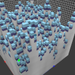
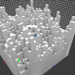
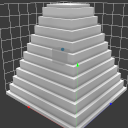
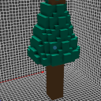

# Scripting api

There is a console command (called `xs`) in [voxedit](voxedit/Index.md) and a command line parameter in [voxconvert](voxconvert/Index.md) to execute lua scripts for generating voxels. This command expects the lua script filename (`.lua` can be omitted) and the additional arguments for the `main()` method.

---

> If you are new to lua you can read more about it on [lua-users](http://lua-users.org/wiki/TutorialDirectory).

---

> **voxedit**
>
> Calling `xs <script> help` (in the script console) will print the supported arguments for the given script file in voxedit.

---

> **voxconvert**
>
> ```
> ./vengi-voxconvert --script "<script> help" --scriptcolor 1 --input in.qb --output out.qb
> ```
>
> `--scriptcolor` defines the color palette index that is given to the script as parameter.

---

By default the script files will be searched in a `scripts` folder next to where the binary is located and in the usual search paths (see [configuration](Configuration.md) for more details). You can also give the full path to the script file.

There are two or three functions in each script: `arguments`, `description` and `main`. `arguments` returns a list of parameters for the `main` function. The default parameters for `main` are `node`, `region` and `color`. `color` is the palette index starting from `0` (the selected color in the palette panel in `voxedit` or the specified color index in `voxconvert` as given by `--scriptcolor`). `description` returns a brief description of what the script is doing.

So the first few parameters are the same for each script call. And the script defines any additional parameter for the `main` function by returing values in the `arguments` function.

## Examples

### Without parameters

```lua
function main(node, region, color)
	local volume = node:volume()
	local mins = region:mins()
	local maxs = region:maxs()
	for x = mins.x, maxs.x do
		for y = mins.y, maxs.y do
			for z = mins.z, maxs.z do
				volume:setVoxel(x, y, z, color)
			end
		end
	end
end
```

Execute this via console `xs scriptfile`

### With one parameter

```lua
function arguments()
	return {
		{ name = 'n', desc = 'height level delta', type = 'int', default = '2' }
	}
end

function description()
	return 'Example'
end

function main(node, region, color, n)
	[...]
end
```

Execute this via console `xs scriptfile 1` where `1` will be the value of `n`. Omitting the `1` will add the `default` value from the argument list.

### Download a file and import it

```lua
local function basename(str)
	local name = string.gsub(str, "(.*/)(.*)", "%2")
	return name
end

function main(_, _, _)
	local url = "https://github.com/vengi-voxel/vengi/raw/9c101f32b84f949ed82f7545883e80a318760580/data/voxel/guybrush.vox"
	local filename = basename(url)
	local stream = g_http.get(url)
	g_import.scene(filename, stream)
end
```

### Find the best palette match

```lua
function main(node, region, color)
	-- find match (palette index) for red in the current palette (RGB value)
	-- this value can be used in e.g. volume:setVoxel(x, y, z, match)
	local match = node:palette():match(255, 0, 0)
	[...]
end
```

This will find the best match in the currently used palette and return the index.

## Arguments

Supported `type`s are:

* `int`: `min`, `max` values are supported, too

* `float`: `min`, `max` values are supported, too

* `enum`: `enum` as a property specifies a list of string separated by `,`

* `str`: string input

* `colorindex`: a color index from current palette (clamped)

* `bool`:

The `desc`ription field is just for the user interface of the script parameter list.

A `default` value can get set, too.

The order in the arguments table defines the order in which the arguments are passed over to the script.

## API Reference

The scripting API provides several global objects and types for working with voxel data.
The detailed documentation for each API is auto-generated and can be found in the linked pages below.

### Global Objects

| Global | Description |
| ------ | ----------- |
| [g_scenegraph](lua/scenegraph.md) | Access to scene graph for creating and managing nodes |
| [g_region](lua/region.md) | Create and work with regions |
| [g_palette](lua/palette.md) | Create and manipulate palettes |
| [g_noise](lua/noise.md) | Noise generation functions |
| [g_shape](lua/shape.md) | Shape generation functions |
| [g_algorithm](lua/algorithm.md) | General purpose algorithms |
| [g_import](lua/import.md) | Import images, palettes, and scenes |
| [g_http](lua/http.md) | HTTP request functions |
| [g_io](lua/io.md) | File I/O operations |
| [g_var](lua/var.md) | Console variable access |
| [g_cmd](lua/cmd.md) | Command execution |
| [g_log](lua/log.md) | Logging functions |
| [g_sys](lua/sys.md) | System utilities |
| [g_vec2, g_vec3, g_vec4, g_ivec2, g_ivec3, g_ivec4](lua/vector.md) | Vector creation |
| [g_quat](lua/quat.md) | Quaternion creation |

### Types

| Type | Description |
| ---- | ----------- |
| [SceneGraphNode](lua/scenegraphnode.md) | A node in the scene graph (model, group, camera, etc.) |
| [Keyframe](lua/keyframe.md) | Animation keyframe data |
| [Volume](lua/volume.md) | Voxel volume data |
| [Region](lua/region.md) | Bounding region for volumes |
| [Palette](lua/palette.md) | Color palette |
| [Stream](lua/stream.md) | Data stream for reading/writing |
| [Image](lua/image.md) | Image data |

### Quick Access Examples

```lua
-- Access the scene graph
local node = g_scenegraph.get()

-- Create a new region
local myregion = g_region.new(0, 0, 0, 10, 10, 10)

-- Create a new palette
local pal = g_palette.new()
pal:load("built-in:minecraft")

-- Generate noise
local value = g_noise.noise3(g_vec3.new(x, y, z))

-- Create shapes
g_shape.cube(pos, width, height, depth, color)

-- HTTP requests
local stream = g_http.get("https://example.com/file.vox")
g_import.scene("model.vox", stream)
```

## Other useful information

* `y` going upwards - see [basics](Basics.md) for further details.

## Available scripts

### animate.lua

Add animations to an existing model if you name the nodes properly.

`xs animate.lua`

### cover.lua

Generates a new voxel on top of others with the current selected color and the specified height.



`xs cover.lua 1`

### grass.lua

Generate grass on top of voxels.


`xs grass.lua`

### grid.lua

Generates a grid with given color, thickness and size.


`xs grid.lua 1 1 5 5 5`

### noise.lua

Generates perlin noise with the frequency and amplitude as parameters with the current selected color.



`xs noise.lua 0.3 1.0`

### pyramid.lua

Generates a pyramid with the current selected color and with each level being 3 voxels high.



`xs pyramid.lua 3`

### thicken.lua

Thickens the voxel - take 1 voxel and convert to 8 voxels (creates a new node for the result).

 

`xs thicken.lua 1`

### others

There are other scripts available [in the repository](https://github.com/vengi-voxel/vengi/blob/master/src/modules/voxelgenerator/lua/scripts/).

## Available modules

### volume.lua

This module is here to ease the process of visiting all the voxels in a volume

> Keep in mind the `-1` is an empty voxel

```lua
local vol = require "modules.volume"

function main(node, region, color, emptycnt, octaves, lacunarity, gain, threshold)
	local visitor = function (volume, x, y, z)
		local color = volume:voxel(x, y, z)
		if color == -1 then
			-- empty voxel
		else
			-- solid voxel
		end
	end

	local condition = function (volume, x, y, z)
		-- add your checks here
		return true
	end
	vol.conditionYXZ(node:volume(), region, visitor, condition)
end
```
