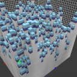
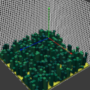
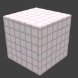
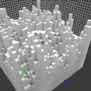
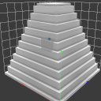
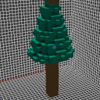
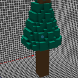

# Scripting api

There is a console command (called `xs`) in [voxedit](voxedit/Index.md) and a command line parameter in [voxconvert](voxconvert/Index.md) to execute lua scripts for generating voxels. This command expects the lua script filename (`.lua` can be omitted) and the additional arguments for the `main()` method.

---

> If you are new to lua you can read more about it on [lua-users](http://lua-users.org/wiki/TutorialDirectory).

---

> **voxedit**
>
> Calling `xs <script> help` (in the script console) will print the supported arguments for the given script file in voxedit.

---

> **voxconvert**
>
> ```
> ./vengi-voxconvert --script "<script> help" --scriptcolor 1 --input in.qb --output out.qb
> ```
>
> `--scriptcolor` defines the color palette index that is given to the script as parameter.

---

By default the script files will be searched in a `scripts` folder next to where the binary is located and in the usual search paths (see [configuration](Configuration.md) for more details). You can also give the full path to the script file.

There are two or three functions in each script: `arguments`, `description` and `main`. `arguments` returns a list of parameters for the `main` function. The default parameters for `main` are `node`, `region` and `color`. `color` is the palette index starting from `0` (the selected color in the palette panel in `voxedit` or the specified color index in `voxconvert` as given by `--scriptcolor`). `description` returns a brief description of what the script is doing.

So the first few parameters are the same for each script call. And the script defines any additional parameter for the `main` function by returing values in the `arguments` function.

## Examples

### Without parameters

```lua
function main(node, region, color)
	local volume = node:volume()
	local mins = region:mins()
	local maxs = region:maxs()
	for x = mins.x, maxs.x do
		for y = mins.y, maxs.y do
			for z = mins.z, maxs.z do
				volume:setVoxel(x, y, z, color)
			end
		end
	end
end
```

Execute this via console `xs scriptfile`

### With one parameter

```lua
function arguments()
	return {
		{ name = 'n', desc = 'height level delta', type = 'int', default = '2' }
	}
end

function description()
	return 'Example'
end

function main(node, region, color, n)
	[...]
end
```

Execute this via console `xs scriptfile 1` where `1` will be the value of `n`. Omitting the `1` will add the `default` value from the argument list.

### Download a file and import it

```lua
local function basename(str)
	local name = string.gsub(str, "(.*/)(.*)", "%2")
	return name
end

function main(_, _, _)
	local url = "https://github.com/vengi-voxel/vengi/raw/9c101f32b84f949ed82f7545883e80a318760580/data/voxel/guybrush.vox"
	local filename = basename(url)
	local stream = g_http.get(url)
	g_import.scene(filename, stream)
end
```

### Find the best palette match

```lua
function main(node, region, color)
	-- find match (palette index) for red in the current palette (RGB value)
	-- this value can be used in e.g. volume:setVoxel(x, y, z, match)
	local match = node:palette():match(255, 0, 0)
	[...]
end
```

This will find the best match in the currently used palette and return the index.

## Arguments

Supported `type`s are:

* `int`: `min`, `max` values are supported, too

* `float`: `min`, `max` values are supported, too

* `enum`: `enum` as a property specifies a list of string separated by `,`

* `str`: string input

* `colorindex`: a color index from current palette (clamped)

* `hexcolor`: a hex RGBA color string (e.g. `#8B4513` or `#8B4513FF`) that is automatically matched to the closest color in the node's palette

* `bool`:

The `desc`ription field is just for the user interface of the script parameter list.

A `default` value can get set, too.

The order in the arguments table defines the order in which the arguments are passed over to the script.

## API Reference

The scripting API provides several global objects and types for working with voxel data.
The detailed documentation for each API is auto-generated and can be found in the linked pages below.

### Global Objects

| Global | Description |
| ------ | ----------- |
| [g_algorithm](lua/algorithm.md) | General purpose algorithms |
| [g_brushcontext](lua/brushcontext.md) | Brush script context (cursor, face, etc.) |
| [g_cmd](lua/cmd.md) | Command execution |
| [g_font](lua/font.md) | Voxel font binding |
| [g_http](lua/http.md) | HTTP request functions |
| [g_import](lua/import.md) | Import images, palettes, and scenes |
| [g_io](lua/io.md) | File I/O operations |
| [g_log](lua/log.md) | Logging functions |
| [g_lsystem](lua/lsystem.md) | Logging functions |
| [g_noise](lua/noise.md) | Noise generation functions |
| [g_normalpalette](lua/normalpalette.md) | Create and manipulate palettes |
| [g_palette](lua/palette.md) | Create and manipulate palettes |
| [g_quat](lua/quat.md) | Quaternion creation |
| [g_region](lua/region.md) | Create and work with regions |
| [g_scenegraph](lua/scenegraph.md) | Access to scene graph for creating and managing nodes |
| [g_sculpt](lua/sculpt.md) | Sculpting functions |
| [g_selectioncontext](lua/selectioncontext.md) | Selection mode script context (cursor, face, etc.) |
| [g_shape](lua/shape.md) | Shape generation functions |
| [g_sparsevolume](lua/sparsevolume.md) | Sparse volume functions |
| [g_sys](lua/sys.md) | System utilities |
| [g_var](lua/var.md) | Console variable access |
| [g_vec2, g_vec3, g_vec4, g_ivec2, g_ivec3, g_ivec4](lua/vector.md) | Vector creation |

### Types

| Type | Description |
| ---- | ----------- |
| [Keyframe](lua/keyframe.md) | Animation keyframe data |
| [Image](lua/image.md) | Image data |
| [Normal Palette](lua/normalpalette.md) | Normal palette |
| [Palette](lua/palette.md) | Color palette |
| [Region](lua/region.md) | Bounding region for volumes |
| [SceneGraphNode](lua/scenegraphnode.md) | A node in the scene graph (model, group, camera, etc.) |
| [Stream](lua/stream.md) | Data stream for reading/writing |
| [Volume](lua/volume.md) | Voxel volume data |

### Quick Access Examples

```lua
-- Access the scene graph
local node = g_scenegraph.get()

-- Create a new region
local myregion = g_region.new(0, 0, 0, 10, 10, 10)

-- Create a new palette
local pal = g_palette.new()
pal:load("built-in:minecraft")

-- Generate noise
local value = g_noise.noise3(g_vec3.new(x, y, z))

-- Create shapes
g_shape.cube(pos, width, height, depth, color)

-- HTTP requests
local stream = g_http.get("https://example.com/file.vox")
g_import.scene("model.vox", stream)
```

## Other useful information

* `y` going upwards - see [basics](Basics.md) for further details.

## Brush scripts

VoxEdit supports Lua-based brush scripts that let you create custom interactive brushes. Unlike generator scripts (which use `main()` and are executed once via the `xs` command), brush scripts define a `generate()` function that is called each time the brush is applied. They also provide an interactive preview in the viewport.

Brush scripts are placed in the `brushes/` directory and are automatically discovered when VoxEdit starts. Each script appears as its own selectable entry in the brush toolbar with a script-defined icon. Use the **Rescan** button in the brush panel to reload scripts after adding or modifying them.

### Brush script structure

A brush script can define the following functions:

- `generate(node, region, color, ...)` **(required)** - Called when the brush is applied. Same API as generator scripts but uses `generate` instead of `main`.
- `arguments()` - Returns parameter definitions (same format as generator scripts).
- `description()` - Returns a brief description string.
- `calcregion(cx, cy, cz, ...)` - Returns 6 integers (minX, minY, minZ, maxX, maxY, maxZ) defining the brush region for preview. If not defined, a single voxel at the cursor is used.
- `settings()` - Returns a table with script settings. Currently supports `{ preview = "simple" }` to use outline-only preview instead of full voxel preview (useful for expensive scripts).
- `icon()` - Returns an icon name string for the brush toolbar button (e.g. `"circle"`, `"star"`, `"wand"`). If not defined, a default icon is used. Available icon names include: blend, box, boxes, brush, circle, cloud, diamond, eraser, expand, flame, footprints, grid2x2, grid3x3, group, hammer, hexagon, image, layers, mountain, move, paintbrush, palette, penline, pencil, pipette, ruler, scan, scroll, snowflake, sparkles, spray, square, stamp, star, sun, swords, target, trees, triangle, wand, waves, zap.
- `gizmo()` - Returns a table describing a 3D gizmo to display in the viewport, or `nil` for no gizmo.
- `applygizmo(translation, rotation, scale, operation)` - Called when the user interacts with the gizmo. Returns `true` if the brush state was changed by the gizmo.

The `generate()` function receives the same global objects as generator scripts (`g_noise`, `g_shape`, `g_palette`, etc.). Additionally, brush scripts have access to `g_brushcontext` which. For further details see [g_brushcontext](lua/brushcontext.md)

### Brush script examples

#### Sphere brush

```lua
local brush = require "brushes.modules.brush"

function arguments()
	return {
		{ name = 'radius', desc = 'Radius of the sphere in voxels', type = 'int', default = '3', min = '1', max = '15' }
	}
end

function description()
	return "Places a sphere of voxels at the cursor position"
end

function icon()
	return "circle"
end

function calcregion(cx, cy, cz, radius)
	return brush.sphereRegion(cx, cy, cz, radius)
end

function generate(node, region, color, radius)
	local volume = node:volume()
	local center = region:center()
	brush.fillSphere(volume, center.x, center.y, center.z, radius, color)
end
```

### Gizmo support

Brush scripts can display interactive 3D gizmos in the viewport for advanced manipulation. Define `gizmo()` and `applygizmo()` functions:

```lua
local offset = { x = 0, y = 0, z = 0 }

function gizmo()
	return {
		position = { offset.x, offset.y, offset.z },
		operations = { "translate" },  -- "translate", "rotate", "scale",
		                               -- "translatex", "translatey", "translatez",
		                               -- "bounds", "line"
		snap = 1.0,
		localMode = false
	}
end

function applygizmo(translation, rotation, scale, operation)
	offset.x = offset.x + translation.x
	offset.y = offset.y + translation.y
	offset.z = offset.z + translation.z
	return false -- return true if the gizmo operation requires a preview volume regeneration
end
```

### Brush utilities module

A shared Lua module `brushes/modules/brush.lua` provides common helper functions:

```lua
local brush = require "brushes.modules.brush"

function generate(node, region, color)
	local volume = node:volume()
	local center = region:center()
	brush.fillSphere(volume, center.x, center.y, center.z, 3, color)
end
```

Available functions:
- `brush.sphereRegion(cx, cy, cz, radius)` - returns 6 values for sphere bounds
- `brush.fillSphere(volume, cx, cy, cz, radius, color)` - fills a sphere
- `brush.fillSphericalShell(volume, cx, cy, cz, outerRadius, innerRadius, color)` - fills a hollow sphere
- `brush.fillBox(volume, region, color)` - fills a box region
- `brush.fillCylinder(volume, cx, cy, cz, radius, height, axis, color)` - fills a cylinder (axis: "x", "y", "z")
- `brush.distanceSquared(x1, y1, z1, x2, y2, z2)` - squared distance between two points

### Differences from generator scripts

| | Generator Scripts | Brush Scripts |
|---|---|---|
| Entry function | `main(node, region, color, ...)` | `generate(node, region, color, ...)` |
| Location | `scripts/` directory | `brushes/` directory |
| Invocation | `xs` command or `--script` | Selected as a brush in the toolbar |
| Preview | None | Live preview at cursor position |
| Region | Selected model region | Defined by `calcregion()` or cursor |
| Preview region | N/A | Optional `calcregion()` callback |

## Selection mode scripts

VoxEdit supports Lua-based selection mode scripts that define custom selection behaviors. These scripts extend the built-in selection modes (All, Surface, Connected, etc.) with user-defined logic.

Selection mode scripts are placed in the `selectionmodes/` directory and are automatically discovered when VoxEdit starts. Each script appears as a selectable entry in the selection mode combo box alongside the native modes. Use the **Rescan** button to reload scripts after adding or modifying them.

### Selection mode script structure

A selection mode script can define the following functions:

- `select(node, region, ...)` **(required)** - Called when the selection is applied. Use `volume:setSelected(x, y, z, true)` to select voxels.
- `arguments()` - Returns parameter definitions (same format as generator scripts).
- `description()` - Returns a brief description string.
- `icon()` - Returns an icon name string for the combo entry (e.g. `"mountain"`, `"scan"`).

The `select()` function has access to the same global objects as generator scripts. Additionally, selection mode scripts have access to `g_selectioncontext` which provides cursor position, face direction, and other context about the selection action. For further details see [g_selectioncontext](lua/selectioncontext.md).

### Selection mode script example

```lua
function arguments()
    return {
        { name = 'deviation', desc = 'Height deviation tolerance', type = 'int', default = '10', min = '0', max = '90' },
        { name = 'sampleDistance', desc = 'Plane bootstrap radius', type = 'int', default = '3', min = '2', max = '16' }
    }
end

function description()
    return "Select voxels along a slope plane"
end

function icon()
    return "mountain"
end

function select(node, region, deviation, sampleDistance)
    local volume = node:volume()
    local pos = g_selectioncontext.cursorPos()
    local face = g_selectioncontext.cursorFace()
    volume:visitSlopeSurface(pos.x, pos.y, pos.z, face, deviation, sampleDistance, function(x, y, z)
        volume:setSelected(x, y, z, true)
    end)
end
```

## Available scripts

### animate.lua

Add animations to an existing model if you name the nodes properly.

`xs animate.lua`

### cover.lua

Generates a new voxel on top of others with the current selected color and the specified height.



`xs cover.lua 1`

### grass.lua

Generate grass on top of voxels.



`xs grass.lua`

### grid.lua

Generates a grid with given color, thickness and size.



`xs grid.lua 1 1 5 5 5`

### noise.lua

Generates perlin noise with the frequency and amplitude as parameters with the current selected color.



`xs noise.lua 0.3 1.0`

### pyramid.lua

Generates a pyramid with the current selected color and with each level being 3 voxels high.



`xs pyramid.lua 3`

### thicken.lua

Thickens the voxel - take 1 voxel and convert to 8 voxels (creates a new node for the result).

 

`xs thicken.lua 1`

### others

There are other scripts available [in the repository](https://github.com/vengi-voxel/vengi/blob/master/src/modules/voxelgenerator/lua/scripts/).

## Available modules

### volume.lua

This module is here to ease the process of visiting all the voxels in a volume

> Keep in mind the `-1` is an empty voxel

```lua
local vol = require "modules.volume"

function main(node, region, color, emptycnt, octaves, lacunarity, gain, threshold)
	local visitor = function (volume, x, y, z)
		local color = volume:voxel(x, y, z)
		if color == -1 then
			-- empty voxel
		else
			-- solid voxel
		end
	end

	local condition = function (volume, x, y, z)
		-- add your checks here
		return true
	end
	vol.conditionYXZ(node:volume(), region, visitor, condition)
end
```
