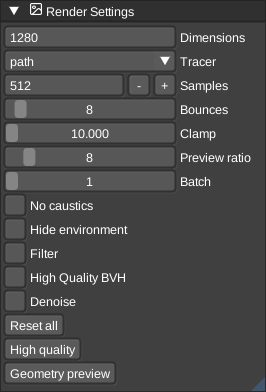
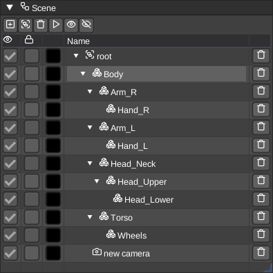
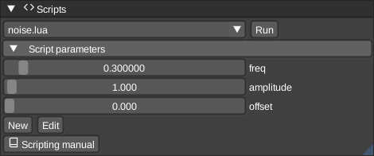
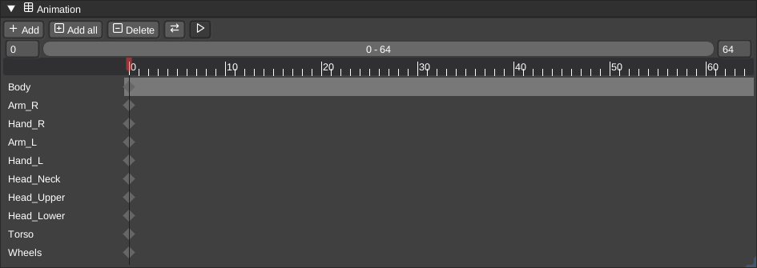
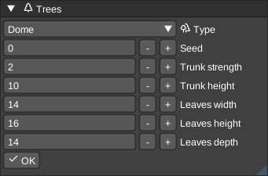

# Usage

## Scene and edit mode

The scene mode is for animating and moving objects in the world - while the edit mode is for modifying voxels in there volumes.

You can toggle between those modes by pressing the `TAB` key in the default binding mode. See [controls](Controls.md).

## Reference position

The current reference position is rendered as a blue dot in the scene (__in edit mode__) and is used to e.g. define the position of where to put procedurally generated content like the trees. It is also used to define the position of where to paste your clipboard at. But also some modifier are using the reference position.

The reference position can be set by pressing enter while hovering a particular voxel - or by using the command `setreferenceposition` - see [controls](Controls.md).

## Brushes

VoxEdit provides several specialized brushes for different types of voxel editing.

### Shape brush

The shape brush creates geometric primitives by spanning an axis-aligned bounding box (AABB) in the viewport. Click and drag to define the size of the shape. The orientation is determined by which face you clicked on initially.

**Available shapes:**

- **AABB (Cube)**: Creates rectangular volumes. Can be hollow or filled depending on the modifier.
- **Torus**: Creates donut shapes with configurable radii.
- **Cylinder**: Generates circular columns along the axis perpendicular to the face you clicked.
- **Cone**: Creates tapered cylinders with the base on the clicked face.
- **Dome**: Generates hemisphere or half-ellipse shapes.
- **Ellipse**: Creates stretched spheres that fill the entire bounding box.

The shape is automatically oriented based on the surface normal of the face where you started dragging.
This allows you to naturally create shapes aligned with your viewing direction.

### Paint brush

The paint brush provides various methods for coloring and modifying existing voxels. The brush only affects existing voxels and won't place new ones, making it ideal for recoloring models without changing their geometry.

**Paint modes:**

- **Replace**: Changes all voxels in the region to the cursor color
- **Brighten**: Makes colors lighter by a configurable factor
- **Darken**: Makes colors darker by a configurable factor
- **Random**: Replaces voxels with random colors from the palette
- **Variation**: Randomly brightens or darkens voxels for natural-looking surfaces

**Special modes:**

- **Plane**: Fills all connected voxels of the same color on the clicked surface
- **Gradient**: Creates smooth color transitions across the region from the hit color to the cursor color

**Options:**

- **Factor**: Controls the brightness adjustment for Brighten/Darken modes (1.0 = no change)
- **Variation Threshold**: For Variation mode, sets the 1 in N chance to modify each voxel

### Plane brush

The plane brush creates or extrudes entire planar surfaces in a single action. When you click a face, it generates voxels across that entire plane. If you drag after clicking, you can extrude the plane outward to create thickness.

This brush is particularly useful for quickly creating walls, floors, or large flat surfaces without having to manually span regions.

### Stamp brush

The stamp brush allows you to place pre-loaded voxel volumes repeatedly into your scene. Think of it as a copy-paste tool that keeps the copied content ready for multiple placements.

**Loading stamps:**

- Drag and drop any supported voxel file onto the viewport
- Right-click in the asset panel to select a stamp
- Create a stamp from a single voxel type with configurable dimensions

**Stamp modes:**

- **Center Mode**: The stamp is centered on the cursor position
- **Corner Mode**: The stamp's corner aligns with the cursor position
- **Continuous Mode**: Keep placing the same stamp with each click

**Offset**: You can configure an offset vector to shift where the stamp is placed relative to the cursor. This is useful for precise alignment or creating regular patterns.

### Line brush

The line brush draws straight lines of voxels from the reference position to wherever you click. The reference position (shown as a blue dot in edit mode) must be set first before using this brush.

**Line options:**

- **Stipple Pattern**: A 9-bit pattern that controls which voxels are placed along the line. Each bit represents one step - set bits place voxels, cleared bits skip them. This allows creating dashed or dotted lines.
- **Continuous Mode**: When enabled, the end point of each line becomes the reference position for the next line, allowing you to chain line segments together without manually updating the reference position.

Lines are drawn using raycasting, ensuring a clean voxel path between the two points.

### Path brush

The path brush creates paths that follow existing voxel surfaces from the reference position to the cursor position. Unlike the line brush which draws straight lines through empty space, the path brush walks along solid voxels.

**Connectivity modes:**

- **Six Connected**: Paths can only move along cardinal directions (up, down, left, right, forward, back)
- **Eighteen Connected**: Paths can move diagonally along edges
- **Twenty-Six Connected**: Paths can move in all directions including diagonal corners

This brush requires existing voxels to walk on and won't work in empty volumes. It's useful for creating roads, pipes, or other features that need to follow terrain.

### Text brush

The text brush voxelizes TrueType fonts into your volume, allowing you to add text labels or create text-based voxel art.

**Text options:**

- **Font**: Choose any TrueType font file (.ttf) from your system
- **Size**: Controls the font size, which determines the height and width of generated characters
- **Spacing**: Sets the distance between individual characters
- **Thickness**: Defines how deep/thick the text appears in 3D space
- **Input**: The text string to generate

The text is placed at the cursor position.

### Texture brush

The texture brush projects image textures onto voxel surfaces, automatically mapping colors from the image to the closest matching colors in your palette.

**Texture options:**

- **Image**: Load any supported image format (PNG, JPG, etc.)
- **UV Coordinates**: Define which portion of the texture to use (UV0 to UV1)
- **Project onto surface**: When enabled, the texture is projected onto existing voxel surfaces. When disabled, it fills the spanned AABB volume.

The texture brush is excellent for adding detailed patterns, logos, or textures to models by converting pixel art into voxels.

### Script brush

Execute custom [Lua scripts](../LUAScript.md) with this brush. Scripts can perform complex operations that aren't possible with the standard brushes, like procedural generation, mathematical transformations, or automated editing tasks.

Check the scripts panel to see available scripts and their parameters. Many scripts use the reference position, cursor position, or current selection to define where they operate.

### Select brush

The select brush doesn't modify voxels directly. Instead, it creates selection regions that limit where other operations can affect voxels (like the [script](../LUAScript.md) execution) or for copy/pasting.

> Don't forget to unselect (__Select__ -> __Select none__) before being able to operate on the whole volume again.

**Using selections:**

1. Switch to the select modifier (or use the select brush)
2. Drag to span a selection box
3. Operations like painting, scripts, or other brushes will only affect voxels inside the selection
4. Use **Select -> Select none** to clear the selection and work on the entire volume again

Selections are useful for protecting parts of your model while editing other areas, or for applying operations to precise regions.

### Color picker

You can either use it from the modifiers panel or by default with the key `p` to pick the color from the current selected voxel.

## Modifiers

The available brushes support several modifiers.

### Place

Place new voxels in your volume.

### Erase

Erase voxels from your volume. There is a shortcut when you are in the other modes to delete voxels: Press the right mouse button (at least in the default binding).

### Override

Override existing voxels with a new color - but also place new voxels.

### Paint

Other than **override** this modifier only changes the color of existing voxels.

## Assets

This is an online and local asset browser for supported [formats](../Formats.md) from gitlab, github, custom urls and apis. You can set the path on your filesystem for local files. This is useful for e.g. the stamp brush or to simply add those local assets to your scene.

## Camera

Allow you to create camera nodes and modify the current camera values

## Console

See the console logs. Also see the [configuration](../Configuration.md) docs for changing the log level

## LSystem

Generate l-system voxel data

## Memento

Visualizes the undo/redo states

## Node Inspector

The node inspector in edit mode can change the size and the position of the voxel volume. Usually you don't want to modify the position of the volume in edit mode, but in scene mode. See below.

The node inspector in scene mode allows one to change the transforms of the scene graph node. You can rotate, scale and move the node in the world to arrange your objects in your scene.

## Palette

The palette panel visualized the colors for a node. The colors can get re-ordered and changed, as well as drag-and-dropped to change the slots. See the dedicated [palette](../Palette.md) docs for more details.

You can re-order the palette colors by __Hue__, __Saturation__, __Brightness__ or __CIELab__ rules.

Direct LoSpec palette import is possible and next to LoSpec you can import or export a lot other palette [formats](../Formats.md), too.

## Renderer

VoxEdit has built-in support for the yocto pathtracer - see [material](../Material.md) docs for details.

You can configure the pathtracer options here.

## Scene View

Here you can see all the nodes and their hierarchy in the scene. You can change the parents by using drag and drop and use a actions from the context menu for each nodes.

You can hide or show nodes from the viewport or lock them to execute some actions on all locked nodes at the same time.

It's also possible to use the play button to loop through all nodes in your scene. Make sure to check out the `Model animation speed` in the options menu to change the animation speed.

Next to these options you can create new nodes - e.g. model or group nodes here.

## Scripts

Here you can execute the [lua scripts](../LUAScript.md) in the editor to modify your scene or the current active volume (depends on the script).

The arguments given in the script are visualized here. This allows you to extend the script panel with your own fields to execute the scripts.

## Animations

Here you can change or create or delete animations from a scene.

The timeline visualized the key frames for each node for each animation.

## Tools

The scene and the edit mode have different tools for you. You can resize, crop, flip or rotate voxels in edit mode or duplicate, center pivot, align or delete nodes in scene mode.

## Tree

Here you can generate a lot of different tree types - all with their own set of configuration options.

## Viewport

The viewport can get changed to scene and edit mode. You can switch the cameras from orthogonal to projection, you can record videos of your scene or let the camera automatically rotate.

## View modes

There are several view modes available - most of them will change the layout and/or options that are available in the ui. There is e.g. a Command & Conquer mode where you can manage the normals that are part of the [vxl](../Formats.md).

Artists that only want to edit voxels without animating them might use the simple layout to get a less complex ui.

## Network

You can start a server to allow others to work on the same scene with you. Head over to the network panel in vengi-voxedit and start a server. Pick the proper interface to bind on. This is usually `0.0.0.0` if you want to have it opened globally. Make sure to open the specified port in your firewall/router. Now clients can connect.
