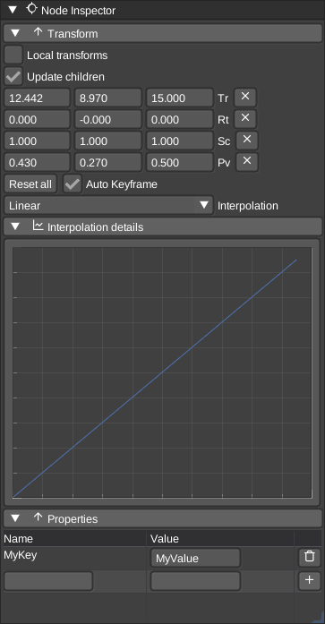

# Node Inspector

The node inspector in edit mode can change the size and the position of the voxel volume. Usually you don't want to modify the position of the volume in edit mode, but in scene mode. See below.

The node inspector in scene mode allows one to change the transforms of the scene graph node. You can rotate, scale and move the node in the world to arrange your objects in your scene.
