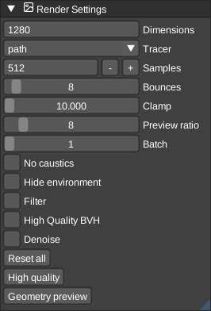

# Renderer

VoxEdit has built-in support for the yocto pathtracer - see [material](../../Material.md) docs for details.

Open the **Render** viewport and use the **Settings** menu in its menubar to configure the pathtracer. Settings are grouped into Presets, Quality, Output, Camera, Lighting, and Advanced. Start and stop the pathtracer from the same menubar.
